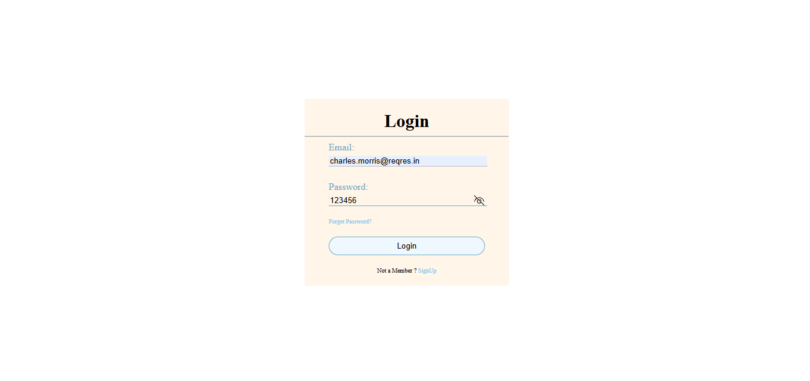
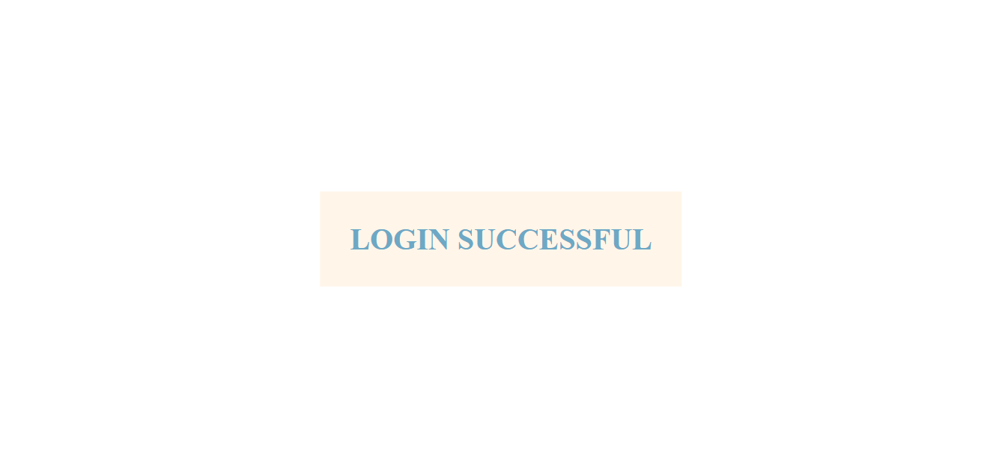

# tarmeez-academy-Login-form-reqres-API-Axios-npm-async-await--reqres-Authentication-API-login-form
this is a simple project that contains html,css and Js file. it is how to use **reqres** **https://reqres.in/** to learn how to (Login-successful) using Axios , this URL need body params (email,password)
in this project i tried to apply login request and change the show on screen (thank you) by change window.location

## Table of contents

- [Overview](#overview)
- [Installation](#Installation)
- [Uage](#Uage)
- [Links](#Links)
- [Screenshot](#Screenshot)
- [What I learned](#what-i-learned)
- [Continued development](#continued-development)
- [Author](#author)
- [Acknowledgments](#Acknowledgments)


## overview
this is a simple project that contains html,css and Js file. it is how to use **reqres** **https://reqres.in/** to learn how to (Login-successful) using Axios , this URL need body params (email,password)
in this project i tried to apply login request and change the show on screen (thank you) by change window.location


## Installation
To get started with this project, follow these steps:

you can clone the project or download it as Zip file.
 Clone the repository:
   ```bash
   git clone https://github.com/olahasan/tarmeez-academy-Login-form-reqres-API-Axios-npm-async-await--reqres-Authentication-API-login-form.git
```

## Uage
1. **Clone the Project**: Users can clone the repository using the provided command.
2. **Install Dependencies**: Running `npm install` will install Axios and any other dependencies specified in your `package.json`.
3. **Run the Project**: They can start the project with `npm start` and access it in their browser.


## Links

If you want to open the link in a new tab, you can:

- Press **Ctrl** (or **Cmd** on Mac) while clicking the link.
- Right-click the link and select **Open link in new tab**.

Otherwise, all links will open in the same tab.

- Solution URL: [here](https://github.com/olahasan/tarmeez-academy-Login-form-reqres-API-Axios-npm-async-await--reqres-Authentication-API-login-form)

**if you want to login successful you should copy those values and past them into input fields**
- **email: "charles.morris@reqres.in"**
- **password: "pistol" or any password**
  
- Live Site URL: [here](https://olahasan.github.io/tarmeez-academy-Login-form-reqres-API-Axios-npm-async-await--reqres-Authentication-API-login-form/)


 ## Screenshot
 




## what-i-learned
Through this project:
- how to use reqres.in website
- how to make login request
- how to install axios(npm)
- how to use async/await
- how to collect between html,css and Js file.
- how to push it on github + gh-pages

## Continued Development
In the future, I plan to:
- do the same project using reactJs in real project.
- store token in localstorage

### Author

GitHub - @olahasan
**[olahasan](https://github.com/olahasan)**

### Acknowledgments
- I would like to thank the **[tarmeez academy](https://www.youtube.com/@tarmeez)** for providing this challenge and to the community for their support.
- I would like to thank the **[reqres API](https://reqres.in/)** for providing this API.
